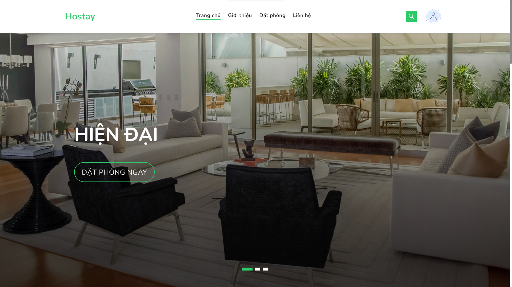
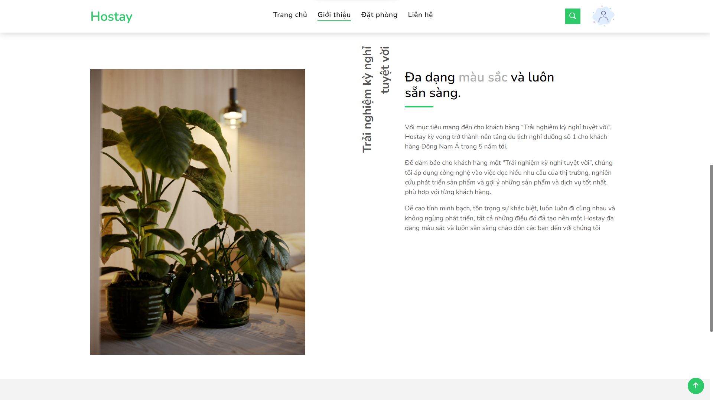
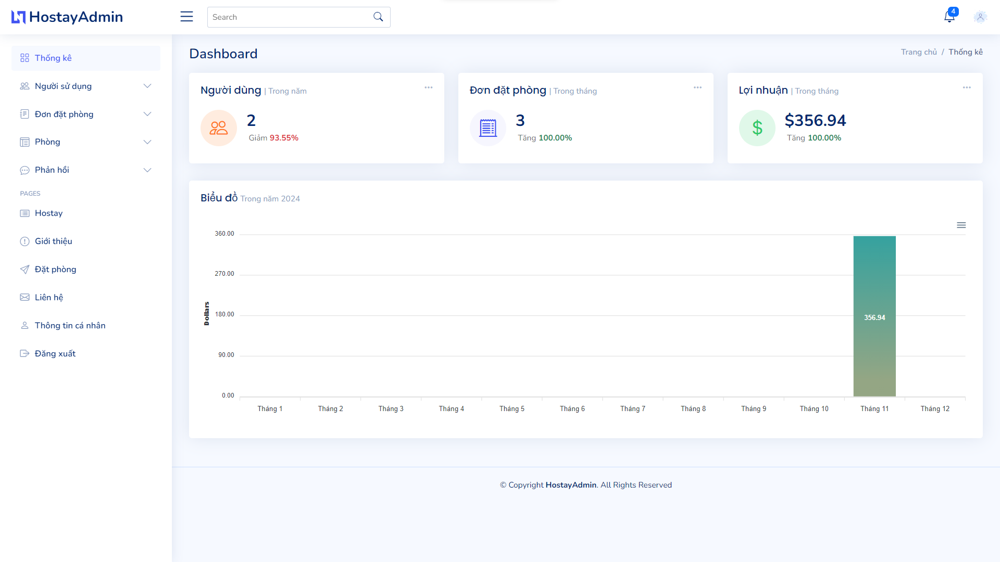

>### Note:
>- This project **Xampp** for local hosting and development.
>- Edit database connectivity configuration in ```php.config.ini```
>- For assistance, please refer to [XAMPP Documentations](https://www.apachefriends.org/docs/)

### Introduction:

This project is inspired by hotel booking websites like [booking.com](booking.com) or [traveloka](traveloka), etc. Functionalities are rather simple as our skills are not quite there yet. But with that being said, we did try our best to complete the project.

**Technologies used:**

- Frontend: HTML5, CSS3, Bootstrap
- Backend: PHP
- Database: MySQL

---

### Installation:

**1. Prerequisite**

- Make sure you have XAMPP installed (If not, download and install it [here](https://www.apachefriends.org/download.html).

- After cloning the repo to your local computer, paste it to the following path: `xampp\htdocs`

**2. Edit config files to connect to port `3307`:**

Locate `xampp\phpMyAdmin\config.inc.php` or open XAMPP Control Panel and choose the `Config` option for `Apache`:

```php
$cfg['Servers'][$i]['auth_type'] = 'config';
$cfg['Servers'][$i]['user'] = 'root';
$cfg['Servers'][$i]['password'] = '';
$cfg['Servers'][$i]['extension'] = 'mysqli';
$cfg['Servers'][$i]['port'] = 3307;      # Edit or add this line
$cfg['Servers'][$i]['AllowNoPassword'] = true;
$cfg['Lang'] = '';
```

Locate `xampp\mysql\bin\my.ini` or open XAMPP Control Panel and choose the `Config` option for `MySQL`:

```ini
# password       = your_password
port=3307                                # Edit or add this line
socket="C:/xampp/mysql/mysql.sock"
```
```ini
# The MySQL server
default-character-set=utf8mb4
[mysqld]
port=3307                                # Edit or add this line
socket="C:/xampp/mysql/mysql.sock"
basedir="C:/xampp/mysql"

```

**3. Create a database on phpMyAdmin**

Create a new database by importing `hostay_db.sql` located at `xampp\htdocs\hostay` 

**4. Start XAMPP**
- Launch the XAMPP Control Panel
- Start the Apache and MySQL services

---
### Demo

<div align="center">
    
</div>


<div align="center">
    
</div>


<div align="center">
    
</div>
